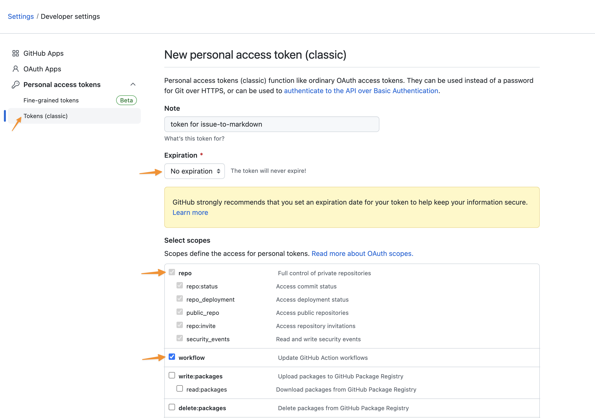

<p align="center">
  <a href="https://github.com/eunjae-lee/issue-to-markdown/actions"></a>
</p>

# issue-to-markdown

> GitHub Action to monitor and convert issues into markdown files within your repository.

How do you edit and manage your markdown files within your repository?

- `git pull`
- (merge conflicts)
- edit files
- `git commit`
- `git push`
- 😫

What if you could automatically convert GitHub Issues into markdown files, allowing you to write using just a browser?

## Usage

Create a file `.github/workflows/issue-to-markdown.yml` (or any filename) in your repository.

```yml
on:
  issues:
    types:
      - labeled

jobs:
  issue_to_markdown:
    runs-on: ubuntu-latest
    steps:
      - uses: actions/checkout@v3
        with:
          token: ${{ secrets.PERSONAL_ACCESS_TOKEN }}
      - uses: eunjae-lee/issue-to-markdown@v0
        with:
          token: ${{ secrets.PERSONAL_ACCESS_TOKEN }}
      - uses: stefanzweifel/git-auto-commit-action@v4
        with:
          commit_message: 'docs: update contents'
```

If you add a `publish` label to any of your issues, this workflow will be activated.

To automatically update the markdown file after making changes to the issue, update the yml file as follows:

```yml
on:
  issues:
    types:
      - labeled
      - edited
```

## How It Works

<details>
<summary>
For those unfamiliar with GitHub Actions, here's a breakdown of the process:
</summary>

1. In this step, the repository is cloned. A personal access token must be provided as token to allow the workflow to commit and push changes to the remote.

```yml
- uses: actions/checkout@v3
  with:
    token: ${{ secrets.PERSONAL_ACCESS_TOKEN }}
```

2. In this step, the issue is transformed into a markdown file, located in its own folder (default location: `content/<slug or issue_number>/index.md`). The token is also necessary here.

```yml
- uses: eunjae-lee/issue-to-markdown@v0
  with:
    token: ${{ secrets.PERSONAL_ACCESS_TOKEN }}
```

3. In this step, changes are committed and pushed to the remote. For more information on customizing the commit, refer to [this](https://github.com/stefanzweifel/git-auto-commit-action).

```yml
- uses: stefanzweifel/git-auto-commit-action@v4
  with:
    commit_message: 'docs: update contents'
```

</details>

## Personal Access Token

Visit https://github.com/settings/tokens/new to create a new personal access token. Choose "Tokens (classic)" instead of "Fine-grained tokens".

<details>
<summary>
Click here to see the screenshots.
</summary>

### 1. Create a personal access token just like the screenshot at https://github.com/settings/tokens/new



### 2. Go to the Settings and add it into the Repository secrets.


</details>

## Options

```yml
- uses: eunjae-lee/issue-to-markdown@v0
  with:
    # Required
    token: ${{ secrets.PERSONAL_ACCESS_TOKEN }}

    # Optional. New files are located at `<project-root>/<dest>/<slug or issue_number>/index.md`. (default: 'content')
    dest: 'content'

    # Optional (default: '.md')
    extension: '.md'

    # Optional. If set to `true`, the `slug` from the frontmatter of the issue body will be used as the folder name instead of `issue_number`. If set to `false`, only `issue_number` is used. (default: true)
    slug_as_folder_name: true

    # Optional. By default, `publish` label is required for the workflow to work.
    label: 'publish'
```

## References

- [Creating a JavaScript action](https://docs.github.com/en/actions/creating-actions/creating-a-javascript-action)
- [TypeScript action template](https://github.com/actions/typescript-action)
- [Branch naming rules](https://github.com/deepakputhraya/action-pr-title)
- [git-auto-commit Action](https://github.com/stefanzweifel/git-auto-commit-action)
